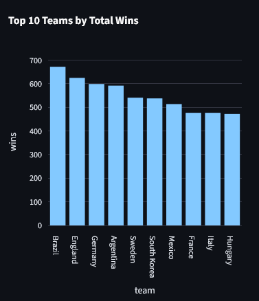
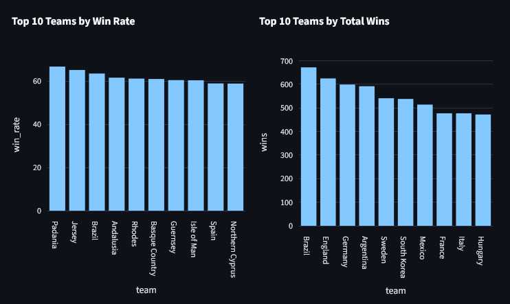
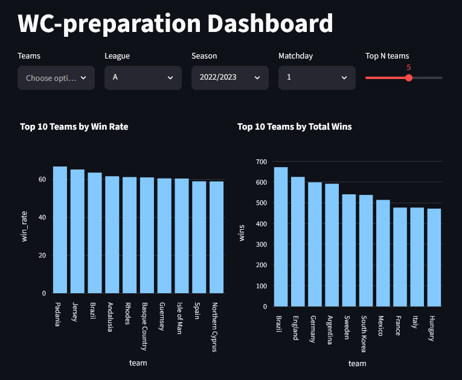
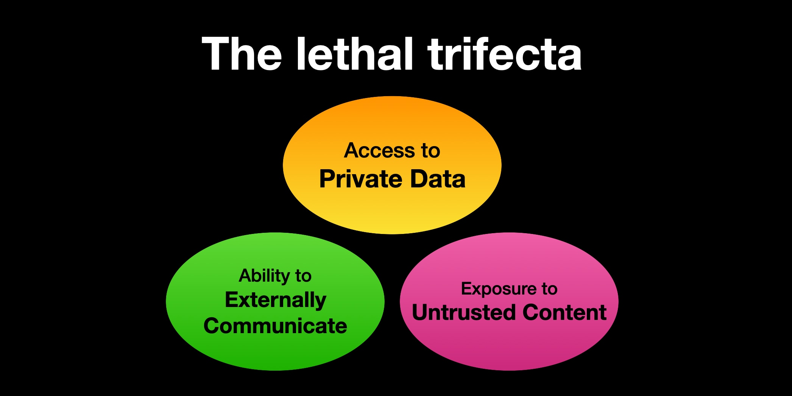

## Agenda

1. Hvorfor
2. Demo
3. Hvordan
4. Hva må man tenke på?

# Hvorfor? {background-gradient="linear-gradient(to bottom, #FF8C45, #FFD865)"}

---

{fig-align="center"}

---

{fig-align="center"}

---

{fig-align="center"}


# Demo {background-gradient="linear-gradient(to bottom, #FF8C45, #FFD865)"}

Kode tilgjengelig på:

<https://github.com/BollaBerg/LLM-supported-dashboards---Systek-fagdag-2026>

# Hvordan? {background-gradient="linear-gradient(to bottom, #FF8C45, #FFD865)"}

## Agenten

```{.python code-line-numbers="|6|9-16|17"}
from google.adk.agents.llm_agent import Agent

from football_agent.tools import query_database

root_agent = Agent(
    model="gemini-2.5-flash",
    name="football_agent",
    description="An assistant that answers questions about football results.",
    instruction="""
    Answer user questions using the tools you have available. If you don't know
    the answer, clearly state that you don't know. Always use the tools when they
    are relevant to the question.

    You have access to run queries against a database. Make sure the query is
    valid SQL. NEVER insert any data into the database, only SELECT from it.
    """,
    tools=[query_database],
)
```

## Tools

```{.python code-line-numbers="|2-16|19-20|30"}
def query_database(query: str) -> dict:
    """
    Query the database with the given query string and return the results as a Markdown-formatted table.

    The database is an SQLite3 database with information about Football results. The database has the following structure:
    - Table: results
      - Columns: id, date, home_team, away_team, home_score, away_score

    Example query: "SELECT home_team, away_team, home_score, away_score FROM results WHERE date == '2022-01-01';"

    Args:
        query (str): The SQL query to execute against the database.

    Returns:
        dict: status and result or error message.
    """
    database_path = Path(__file__).parent.parent.parent / "data" / "database.db"
    try:
        with sqlite3.connect(database_path) as conn:
            df = pd.read_sql_query(query, conn)
    except Exception as e:
        return {
            "status": "error",
            "result": f"An error occurred while querying the database: {str(e)}",
        }

    if df.empty:
        return {"status": "success", "result": "No results found."}

    return {"status": "success", "result": df.to_markdown(index=False)}
```

## Runner

```{.python code-line-numbers="|2-5|7-11|13-17"}
async def run_async(session_id: str, new_message: str):
    content = types.Content(
        role="user",
        parts=[types.Part.from_text(text=new_message)]
    )
    
    raw_stream = _runner.run_async(
        user_id="user_123",
        session_id=session_id,
        new_message=content,
    )

    async for message in raw_stream:
        if message.content
        and message.content.parts
        and message.content.parts[0].text:
            yield message.content.parts[0].text
```

# Hva må man tenke på? {background-gradient="linear-gradient(to bottom, #FF8C45, #FFD865)"}

## Pris

- Tokens koster
- Prompt og verktøybeskrivelser blir også tokens

. . .

- Mitigering:
    - Optimaliser prompt
    - Optimaliser verktøybeskrivelser
    - Cache svar der det er mulig
    - Lær fra brukerne

## Hallusinering

- LLM-er kan finne på informasjon

. . .

- Mitigering:
    - Kort avstand fra data til svar
    - Dobbeltsjekk der mulig


## Sikkerhet

- Agenter gjør som de får beskjed om
- Instrukser _kan_ og _vil_ overstyres
- Verktøy kan misbrukes

## Sikkerhet

{fig-align="center"}

::: aside
<https://simonwillison.net/2025/Jun/16/the-lethal-trifecta/>
:::

## Sikkerhet

- Mitigering:
    - Ikke stol på prompts
    - Ikke gi LLM flere tilganger enn brukeren
    - Flytt sikkerheten ut av LLM-nivå


# Takk for meg {background-gradient="linear-gradient(to bottom, #FF8C45, #97D2EC)"}


